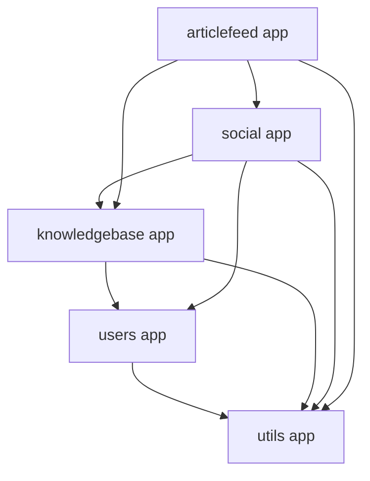

# Architecture

## System Overview

Knowledge-Share is a server-rendered **Django** web application that lets users
build a personal knowledgebase of articles, follow other users, message each
other, and browse a feed of published articles. The majority of pages are
rendered with Django templates; a handful of interactive features (follow/unfollow,
messaging, notifications, the article feed) are backed by **Django REST
Framework (DRF)** JSON endpoints consumed via JavaScript on the page.

- **Architectural style**: Monolithic Django project (single deployable),
  organized into Django "apps" by domain. A small number of endpoints inside
  that monolith expose a REST API surface for AJAX-driven UI widgets — this is
  not a separate service, just DRF views living alongside the template views.
- **Entry point**: `manage.py` / `config/wsgi.py` (gunicorn in production, per
  `Procfile`).
- **Routing root**: `config/urls.py` mounts each app's `urls.py` under a path
  prefix (`social/`, `users/`, `articlefeed/`, `knowledgebase/`).

## Applications (components)

| App | Responsibility |
|---|---|
| `KnowledgeShare.users` | Account lifecycle — registration, login/logout, password reset, account settings/deletion, and the admin-only log viewer (`users:logs`). Defines the custom `User` model. |
| `KnowledgeShare.knowledgebase` | The core domain: `Article` and `Folder` management, versioning/publishing workflow, full-text search over a user's knowledgebase, article sharing between users. |
| `KnowledgeShare.social` | Following/followers, direct messaging, and notifications. Exposes the project's DRF API surface and OpenAPI schema. |
| `KnowledgeShare.articlefeed` | The cross-user feed of published articles, with filtering (by author, date range, search query). |
| `KnowledgeShare.utils` | Cross-cutting code shared by the other apps: the `TimeStampedModel` abstract base, the structured XML log formatter/parser, DRF pagination/schema helpers, and the `notifications` template context processor. |

### Dependency graph

`articlefeed` depends on `social` only indirectly through shared conventions
(pagination, following-list filtering) — there is no direct import, but both
apps query the `following`/`followers` relationship defined on `users.User`.

## Request flow

A typical page render:

1. `config/urls.py` dispatches to the owning app's `urls.py`.
2. The app's `views.py` (or `views/` package, for `knowledgebase`) handles the
   request: Class-based `View`s (`django.views.generic.View`) for page/
   form-post flows; DRF `GenericAPIView`/`ListAPIView` subclasses under each
   app's `api/` package for JSON endpoints.
3. Views call into `models.py` (business logic lives on the model, e.g.
   `Article.create_new_version()`, `Article.publish_article()`) or into
   `helpers.py` (e.g. `knowledgebase/helpers.py`'s full-text search functions)
   and `forms.py` for validation.
4. Template views render a Django template from `KnowledgeShare/templates/<app>/`;
   API views return a DRF `Response` serialized by a class in the app's
   `api/serializers.py`.

## Authentication & authorization

- `AUTH_USER_MODEL = 'users.User'` — a custom user model extending
  `AbstractUser` with `profile_image`, `bio`, and symmetrical-free
  `followers`/`following` self-referential M2M fields.
- Views requiring a logged-in user use `django.contrib.auth.mixins.LoginRequiredMixin`
  — including `KnowledgeBaseView` (`KnowledgeShare/knowledgebase/views/knowledgebase_views.py`),
  per [[dec-anon-guard-uses-login-required-mixin]], which guards knowledgebase
  POSTs against anonymous users the same way every other authenticated view in
  the codebase does.
- DRF API views under `social/api/views.py` use `SessionAuthentication` +
  `IsAuthenticated` explicitly (`FollowUnfollowView`, `MessagesListView`,
  `NotificationsListView`).
- Earlier revisions carried unused custom authorization decorators that were
  never wired to any view; per [[dec-dead-decorators-removal]] these were
  removed rather than retrofitted, since every view already enforces access
  control through mixins/permission classes.

## Error handling conventions

- `FollowUnfollowView.post` (`KnowledgeShare/social/api/views.py`) catches any
  exception from the follow/unfollow transaction, logs it via `logger.exception`
  through the project's standard `logging` pipeline (see below), and raises a
  generic DRF `APIException` with a fixed 500 message — it does not leak the
  raw exception text to the client, per [[dec-error-logging-reuses-existing-pipeline]].
- `users.views.LoggingView` reads the day's structured log file with
  `KnowledgeShare.utils.xml.XMLParse`, building the file path with
  `pathlib.Path('logs') / log_filename` (per [[dec-log-path-uses-pathlib]]) so
  the path separator is correct regardless of host OS, rather than the
  previous hardcoded Windows-style `\\` join.

## Logging

All three settings modules (`dev`, `prd`, `ci_testing`) configure Django's
`LOGGING` dict with a `django` logger writing to `logs/`. `dev`/`prd` use the
custom `KnowledgeShare.utils.formatters.XMLLogFormatter`, which emits each log
record as a single `<log>...</log>` XML element (escaping the message body).
`users.views.LoggingView` is the only consumer that reads these files back,
via `KnowledgeShare.utils.xml.XMLParse` — see `docs/data-model.md` for the
`User.is_superuser` gate that restricts this view (`users:logs`) to superusers.

## Search

Both the knowledgebase (`knowledgebase/helpers.py`) and the article feed
(`articlefeed/filters.py`) search use Postgres full-text search
(`SearchVector`/`SearchRank`) combined with trigram similarity
(`django.contrib.postgres.search.TrigramSimilarity`). Trigram similarity
requires the `pg_trgm` Postgres extension, enabled via Django's
`TrigramExtension` migration operation in
`KnowledgeShare/knowledgebase/migrations/0012_pg_trgm_extension.py`, per
[[dec-pg-trgm-via-trigram-extension-migration]] — this keeps the extension
enable step inside Django's own migration graph instead of a manual DBA step.

## Static files, media, and third-party uploads

- Static assets are collected to `STATIC_ROOT` and served via
  `whitenoise.middleware.WhiteNoiseMiddleware` with compressed storage.
- User-uploaded media (profile images, article images) uses Django's
  `ImageField`. In production (`config/settings/prd.py`), uploads are stored
  on Cloudinary via `dj3-cloudinary-storage`, configured by `CLOUDINARY_STORAGE`
  — see `docs/environment.md` for the exact variable names, which were
  corrected from a typo'd `ClOUDINARY_*` to `CLOUDINARY_*` by the
  config-settings-fixes unit ([[contract-cloudinary-env-names]]).

## Deployment

`Procfile` defines a two-process deploy: a `release` phase running
`python manage.py migrate`, and a `web` process running `gunicorn config.wsgi`.
CI (`.github/workflows/django.yml`) runs against `config.settings.ci_testing`
with a Postgres service container, lints with `flake8`, and runs
`coverage run manage.py test`.
