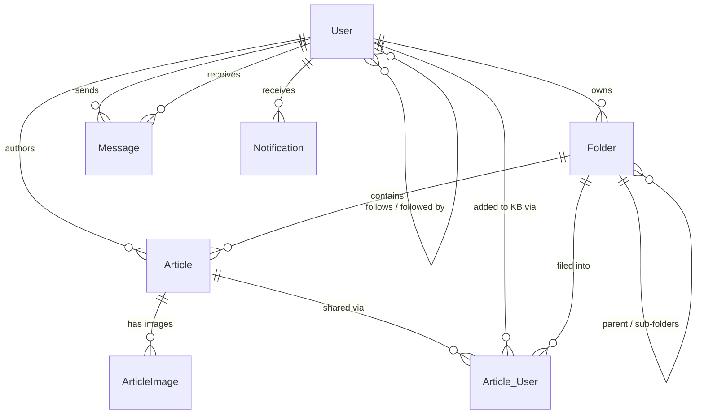

# Data Model

All models use Django's ORM against Postgres (`django.db.backends.postgresql`).
Primary keys are `BigAutoField` by default (`DEFAULT_AUTO_FIELD` in
`config/settings/base.py`).

## Shared base: `TimeStampedModel`

`KnowledgeShare/utils/models.py` — abstract base class, not a table of its own.

| Field | Type | Notes |
|---|---|---|
| `created_on` | `DateTimeField` | `auto_now_add=True` |
| `updated_on` | `DateTimeField` | `auto_now=True` |

Used by `Article`, `Folder`, and `Notification`.

## `User` (`KnowledgeShare.users.models.User`)

Extends `django.contrib.auth.models.AbstractUser`. Configured as
`AUTH_USER_MODEL = 'users.User'`.

| Field | Type | Notes |
|---|---|---|
| `email` | `EmailField` | `unique=True` |
| `profile_image` | `ImageField` | `null=True, blank=True`, `upload_to='profile_images'` |
| `bio` | `TextField` | `max_length=500, blank=True` |
| `followers` | `ManyToManyField('self')` | asymmetrical, `related_name='user_followers'` |
| `following` | `ManyToManyField('self')` | asymmetrical, `related_name='user_following'` |

Plus all standard `AbstractUser` fields (`username`, `first_name`, `last_name`,
`is_superuser`, `is_staff`, `is_active`, password hash, etc.).

**Methods**: `count_followers()`, `count_following()`.

**Relationships**: `followers`/`following` are independent, non-symmetrical
M2M self-relations — "A follows B" does not imply "B follows A". A's `following`
set contains B; B's `followers` set contains A (both sides are updated
together by application code in `FollowUnfollowView`, not by the ORM
automatically).

## Knowledgebase app

### `Folder` (extends `TimeStampedModel`)

| Field | Type | Notes |
|---|---|---|
| `name` | `CharField` | `max_length=200` |
| `parent_folder` | `ForeignKey('self')` | `on_delete=CASCADE`, `null=True, blank=True` — enables nested folder hierarchies |
| `owner` | `ForeignKey(AUTH_USER_MODEL)` | `on_delete=CASCADE` |

**Static method**: `Folder.UserFolders(user)` — all folders owned by `user`.

### `Article` (extends `TimeStampedModel`)

| Field | Type | Notes |
|---|---|---|
| `author` | `ForeignKey(AUTH_USER_MODEL)` | `on_delete=SET_NULL`, `null=True` |
| `title` | `CharField` | `max_length=200, blank=True` |
| `slug` | `SlugField` | `max_length=200, blank=True` |
| `article_status_id` | `SmallIntegerField` | choices: `Article_Status` (`DRAFT=1`, `PUBLISHED=2`, `ARCHIVED=3`) |
| `content` | `TextField` | `blank=True` — rich text (TinyMCE) |
| `version` | `IntegerField` | `default=0` |
| `version_status_id` | `SmallIntegerField` | choices: `Version_Status` (`ACTIVE=4`, `HISTORY=5`, `NEW_VERSION=6`) |
| `uuid` | `UUIDField` | `db_index=True`, `default=uuid4`, `editable=False` — stable identity across versions |
| `folder` | `ForeignKey('Folder')` | `on_delete=CASCADE`, `null=True, blank=True` |
| `foreign_users` | `ManyToManyField(AUTH_USER_MODEL, through='Article_User')` | `related_name='foreign_articles'` |

**Versioning model**: every edit-and-save of a "new version" creates a new
`Article` row sharing the same `uuid`. `article_status_id` tracks the
publish lifecycle (draft/published/archived); `version_status_id` tracks
which row is the currently active/visible one (`ACTIVE`), a working draft
(`NEW_VERSION`), or a superseded prior publish (`HISTORY`).

**Methods**:
- `create_new_version()` — deletes any existing `NEW_VERSION` row for the same
  `uuid`, then creates a fresh `DRAFT`/`NEW_VERSION` row copying the current
  content.
- `publish_article()` — archives every other row sharing the `uuid` (sets them
  `ARCHIVED`/`HISTORY`), then marks the current row `PUBLISHED`/`ACTIVE`.
- `truncated_content` (property) — strips HTML tags and truncates to 20 words,
  used for feed previews.

### `ArticleImage`

| Field | Type | Notes |
|---|---|---|
| `article_id` | `ForeignKey('Article')` | `on_delete=CASCADE` (field name kept as-is; it is a FK, not a raw id) |
| `image` | `ImageField` | `upload_to='article_images'` |

### `Article_User`

Join table backing `Article.foreign_users` — represents one user's copy of
another author's article in their own knowledgebase, optionally filed into
one of their own folders.

| Field | Type | Notes |
|---|---|---|
| `article` | `ForeignKey('Article')` | `on_delete=CASCADE` |
| `user` | `ForeignKey(AUTH_USER_MODEL)` | `on_delete=CASCADE` |
| `folder` | `ForeignKey('Folder')` | `on_delete=CASCADE`, `null=True, blank=True` |

**Constraint**: `UniqueConstraint(fields=['article', 'user'])` named
`unique article_user` — a user can only add a given article to their
knowledgebase once.

## Social app

### `Message`

| Field | Type | Notes |
|---|---|---|
| `sender` | `ForeignKey(AUTH_USER_MODEL)` | `on_delete=SET_NULL`, `null=True`, `related_name='sender'` |
| `recipient` | `ForeignKey(AUTH_USER_MODEL)` | `on_delete=SET_NULL`, `null=True`, `related_name='recipient'` |
| `content` | `TextField` | |
| `message_sent_date` | `DateTimeField` | `auto_now=True` |
| `message_read` | `BooleanField` | `default=False` |
| `conversation_id` | `CharField` | `max_length=200` — computed in `save()` |

**`save()` override**: computes `conversation_id` as `"{min(sender_id, recipient_id)}-{max(sender_id, recipient_id)}"`,
so both directions of a conversation share one id, then creates a `Notification`
for the recipient before calling `super().save()`.

### `Notification` (extends `TimeStampedModel`)

| Field | Type | Notes |
|---|---|---|
| `message` | `CharField` | `max_length=300` — HTML snippet rendered as-is in templates |
| `user` | `ForeignKey(AUTH_USER_MODEL)` | `on_delete=CASCADE` — the recipient |
| `seen` | `BooleanField` | `default=False` |

Created by `Message.save()` (new-message notification) and
`FollowUnfollowView.post` (new-follower notification).

## Entity relationship diagram

